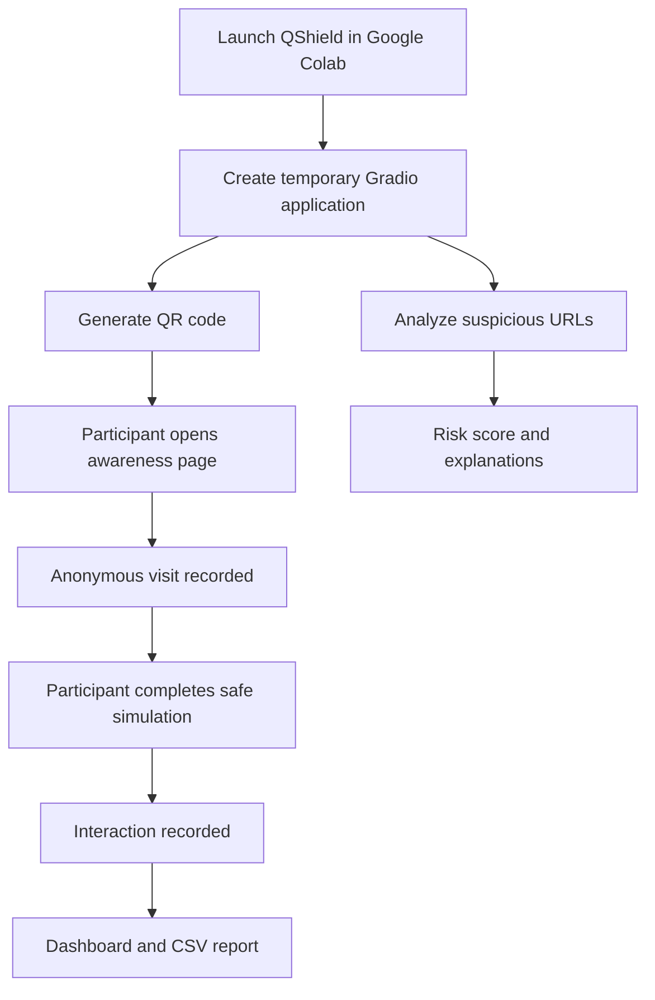

<div align="center">

# QShield AI

### QR Phishing Awareness & Security Analysis Platform

A practical cybersecurity awareness laboratory for simulating suspicious QR-code interactions, assessing URL risk, and monitoring anonymous campaign engagement.

[](https://www.python.org/)
[](https://www.gradio.app/)
[](https://colab.research.google.com/)
[](LICENSE)

[](https://colab.research.google.com/github/aaravxsingh15/qshield-ai/blob/main/Untitled6.ipynb)

</div>

---

## Overview

QR codes are widely used for payments, authentication, advertisements, and information sharing. However, because their destinations are not immediately visible, malicious QR codes can redirect users to deceptive or unsafe websites.

**QShield AI** provides a controlled environment for exploring this threat through ethical awareness simulations, suspicious-URL analysis, and anonymous interaction tracking.

The project is designed for cybersecurity learning, security demonstrations, and authorized awareness campaigns.

> QShield is an educational simulation. It does not collect real passwords, financial information, or personal credentials.

---

## Core Features

### QR Awareness Simulation

- Generate QR codes linked to an interactive demonstration page.
- Simulate how an unexpected QR destination might encourage user interaction.
- Use fictional account details and predefined training codes.
- Record anonymous campaign events without collecting credentials.

### Suspicious URL Analysis

Evaluate URLs against common phishing indicators, including:

- Unencrypted HTTP connections.
- IP-address-based destinations.
- URL-shortening services.
- Suspicious authentication-related keywords.
- Misleading `@` symbols.
- Punycode domains.
- Excessively long URLs.

Each URL receives an explainable risk score between **0 and 100**.

### Campaign Analytics

- Track anonymous landing-page visits.
- Measure demonstration interactions.
- Calculate campaign interaction rates.
- Visualize activity using interactive charts.
- Export event data as CSV.

### Google Colab Integration

- Run directly from a browser.
- No local development environment required.
- Generate a temporary shareable Gradio application.
- Test the QR code from a separate device.

---

## Application Preview

<div align="center">


</div>

---

## How It Works



---

## Risk Classification

| Score | Classification | Interpretation |
|:-----:|:--------------:|:---------------|
| 0–29 | Low risk | No significant indicators, although safety is not guaranteed. |
| 30–59 | Medium risk | The URL contains characteristics requiring closer inspection. |
| 60–100 | High risk | Multiple suspicious indicators suggest elevated phishing risk. |

### Example

```text
URL:
http://192.168.1.50/verify-account

Classification:
HIGH RISK

Risk score:
70/100

Detected indicators:
- Connection does not use HTTPS.
- Destination uses an IP address instead of a domain name.
- URL contains wording commonly used in phishing messages.
```

---

## Technology Stack

| Component | Technology |
|:----------|:-----------|
| Programming language | Python |
| Interactive interface | Gradio |
| QR code generation | qrcode |
| Data analysis | pandas |
| Visualization | matplotlib |
| Execution environment | Google Colab |
| Report format | CSV |

---

## Getting Started

### Option 1: Run on Google Colab

Open the notebook directly:

[](https://colab.research.google.com/github/aaravxsingh15/qshield-ai/blob/main/Untitled6.ipynb)

1. Open the notebook.
2. Run all cells in sequence.
3. Wait for the Gradio shareable link to appear.
4. Generate the QR code.
5. Scan it using a phone or another device.
6. Complete the clearly labeled awareness simulation.
7. Refresh the analytics dashboard.
8. Download the CSV report if required.

### Option 2: Run Locally

Clone the repository:

```bash
git clone https://github.com/aaravxsingh15/qshield-ai.git
cd qshield-ai
```

Install the required libraries:

```bash
pip install gradio "qrcode[pil]" pandas matplotlib jupyter
```

Launch Jupyter:

```bash
jupyter notebook
```

Open `Untitled6.ipynb` and run the notebook cells in order.

> The notebook exports its CSV report to `/content/` for Google Colab. When running locally, update that output path to a suitable directory on your computer.

---

## Example Campaign Report

```csv
timestamp,event_type
2026-08-21 12:03:00,qr_page_visit
2026-08-21 12:03:25,demo_interaction
2026-08-21 12:04:11,qr_page_visit
```

Recorded events contain:

- Event timestamp.
- Event type.
- No passwords.
- No financial information.
- No personally identifiable credentials.

A sample report is available in:

```text
qshield_awareness_report.csv
```

---

## Repository Contents

```text
qshield-ai/
├── Untitled6.ipynb
├── qshield_awareness_report.csv
├── Screenshot 2026-08-21 173549.png
├── WhatsApp Image 2026-08-21 at 5.35.37 PM.jpeg
└── LICENSE
```

---

## Security and Ethical Use

QShield must only be used for:

- Authorized cybersecurity education.
- Controlled awareness demonstrations.
- Defensive security research.
- Training involving informed participants.

It must not be used for:

- Collecting real credentials.
- Impersonating legitimate organizations.
- Conducting unauthorized phishing campaigns.
- Harassing, tracking, or deceiving unsuspecting individuals.

The application deliberately uses fictional demonstration data and records only limited anonymous event information.

---

## Limitations

- Gradio share links are temporary.
- The application remains available only while the notebook session is running.
- Event data is stored in memory during the active session.
- URL analysis is heuristic-based and cannot guarantee whether a destination is safe.
- Results should be interpreted as educational indicators rather than definitive threat intelligence.

---

## Future Improvements

- Machine-learning-based phishing URL classification.
- Expanded suspicious-domain analysis.
- QR destination preview before redirection.
- Persistent campaign storage.
- Additional analytics and visualization.
- Automated PDF awareness reports.
- Threat-intelligence integrations.
- Multi-campaign management.

---

## Author

**Aarav Singh**

Mathematics & Computing student exploring artificial intelligence, machine learning, and cybersecurity.

[GitHub Profile](https://github.com/aaravxsingh15)

---

## License

This project is distributed under the **MIT License**. See [LICENSE](LICENSE) for details.

---

<div align="center">

**Scan carefully. Verify destinations. Stay secure.**

</div>
